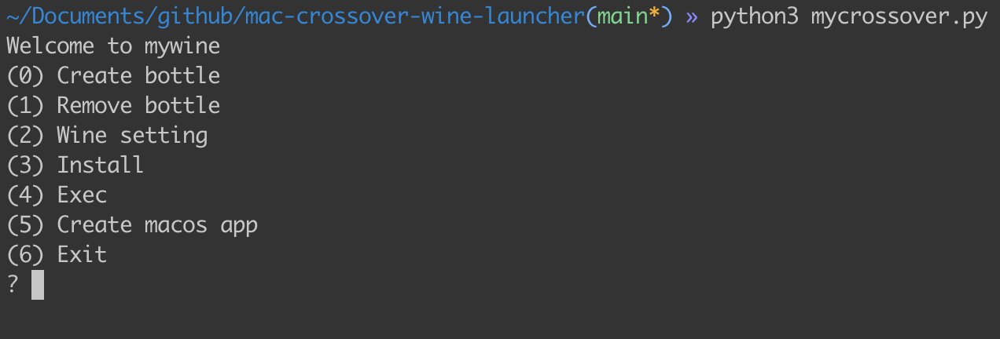
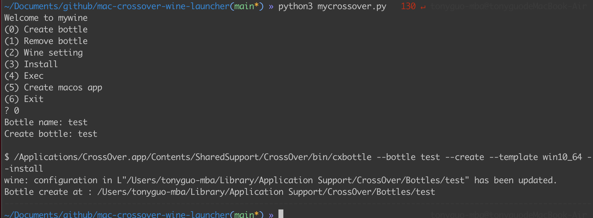
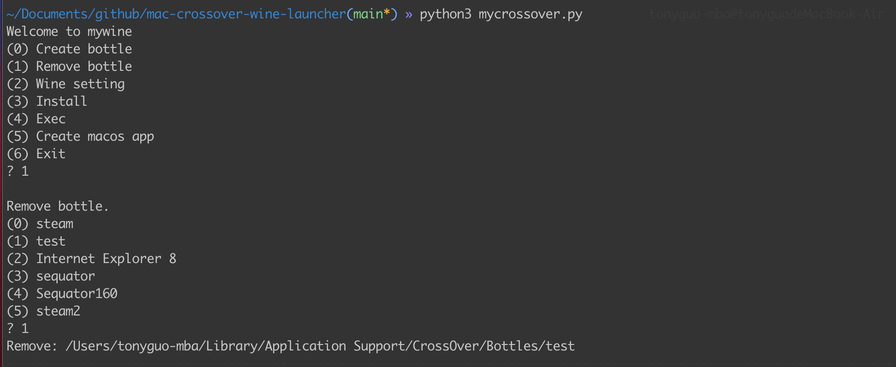
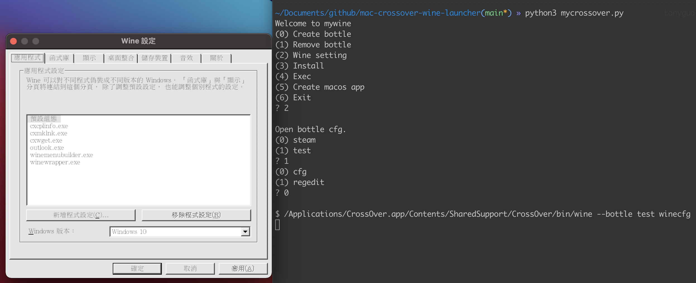
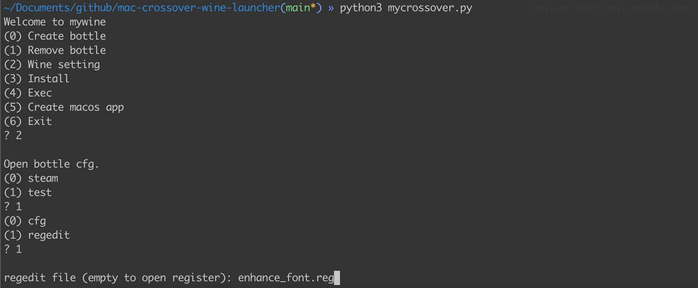
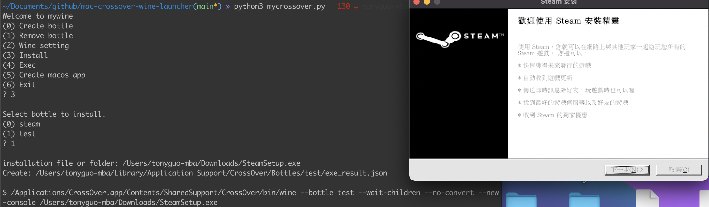
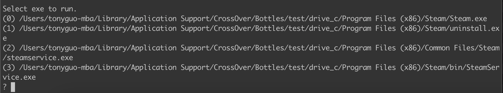
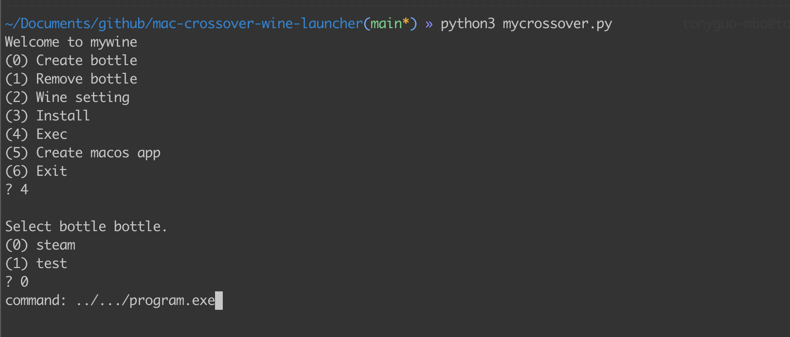
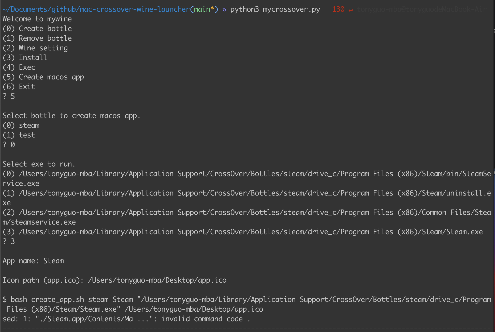
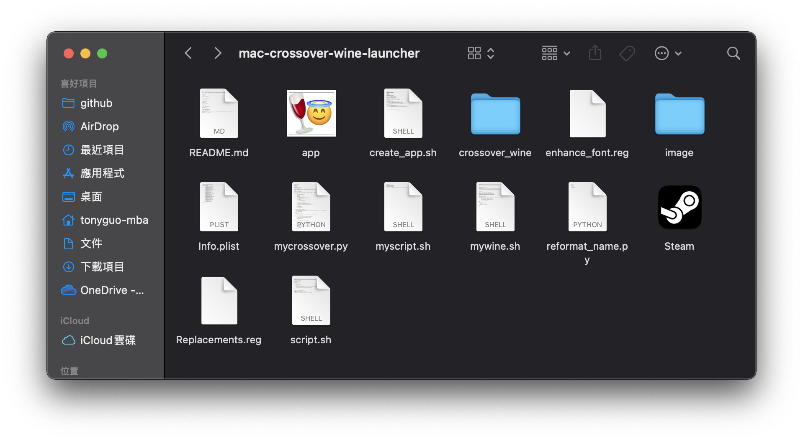

# mac-crossover-wine-launcher

## Introduction
This is a launcher of wine version of crossover application. Directed access wine binary from whether formal or trial edition.

## How to use

```shell
cd <repo path>
python3 mycrossover.py
```



there are 6 option

```
(0) Create bottle 
(1) Remove bottle
(2) Wine setting
(3) Install
(4) Exec
(5) Create macos app
(6) Exit
```

### Create bottle 


### Remove bottle


### Wine setting



### Install
The installation process clould accept .msi, .exe file and folder. While installing, this program will scan the added .exe file in the bottle.




### Exec



### Create macos app
This will package the shell script that can launch installed program as a mac application.




